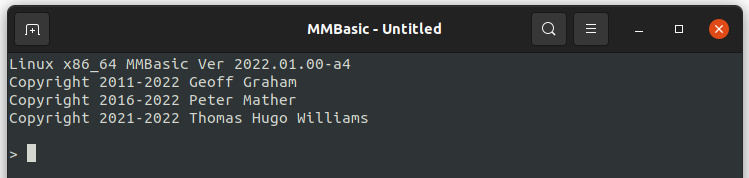

# MMBasic for Linux (MMB4L)

MMB4L is a port of Geoff Graham's [MMBasic](https://mmbasic.com/) interpreter to the Linux platform (and its derivatives).

Specifically MMB4L is derived with permission from:
 * [MMBasic for Windows/DOS](https://geoffg.net/WindowsMMBasic.html)
     * Copyright 2011-2021 Geoff Graham<br/><br/>
 * [MMBasic for the Colour Maximite 2](https://geoffg.net/maximite.html)
     * Copyright 2011-2021 Geoff Graham
     * Copyright 2016-2021 Peter Mather

It also incorporates a small amount of code from the mothballed Pic**RO**mite (not to be confused with Pi**C**omite) project by Peter Mather.

What little MMB4L specific code there is, is Copyright 2021 Thomas Hugo Williams.

MMB4L is distributed FREE for use in BINARY form.

## How do I install it ?

MMB4L is in the early alpha phase so there are no fancy installers yet:

 1. Download the latest .tar.gz for your platform from the [distributions](distributions) directory:
    * For 64-bit Linux running on Intel/AMD use the 'x86_64' distribution.
    * For 24-bit Linux running on Intel/AMD use the 'i686' distribution.
    * For 32-bit Raspbian/Linux running on Raspberry Pi use the 'armv6l' distribution.

 2. Extract the archive into a temporary location:
    * ```mkdir -p ~/tmp && tar -xf mmb4l-<version>.tar.gz --directory ~/tmp```

 3. Copy the "mmbasic" executable to "/usr/local/bin":
    * ```sudo cp ~/tmp/mmb4l-<version>/mmbasic /usr/local/bin```

 4. Check you have the "nano" editor installed, and determine the version:
    * ```nano --version```
    * If it is not installed then [install it](https://phoenixnap.com/kb/use-nano-text-editor-commands-linux).

 4. Copy the nano resource files for MMB4L:
    * If you are running nano 4.8+:
        * ```mkdir -p ~/.mmbasic```
        * ```cp ~/tmp/mmb4l-<version>/mmbasic.nanorc ~/.mmbasic```
        * ```cp ~/tmp/mmb4l-<version>/mmbasic.syntax.nanorc ~/.mmbasic```

    * If you have an earlier version and are not using it for anything else:
        * ```mkdir -p ~/.nano```
        * ```cp ~/tmp/mmb4l-<version>/mmbasic.syntax.nanorc ~/.nano```
        * ```cp ~/tmp/mmb4l-<version>/mmbasic.nanorc ~/.nanorc```
        * Edit "~/.nanorc" and change last line to: ```include ~/.nano/mmbasic.syntax.nanorc```

    * If you are an existing nano user:
        * ```mkdir -p ~/.nano```
        * ```cp ~/tmp/mmb4l-<version>/mmbasic.syntax.nanorc ~/.nano```
        * Edit "~/.nanorc" and append the line: ```include ~/.nano/mmbasic.syntax.nanorc```
        * If desired incorporate settings/bindings from "\~/tmp/mmb4l-\<version>/mmbasic.nanorc" into your existing "\~/.nanorc" file.

## How do I run it ?

 * Type `mmbasic` at the Linux shell and it should show the start banner and display a BASIC command prompt:

    

 * To have MMB4L immediately run a program ...
     * ... and exit when the program ends or reports an error:
         * `mmbasic myprogram.bas arg1 arg2 arg3`
     * ... and return to the BASIC command prompt when the program ends or reports an error use the `-i`, `--interactive` command-line option:
         * `mmbasic -i myprogram.bas arg1 arg2 arg3`
     * any command-line arguments to the BASIC program are retrievable using `MM.CMDLINE$`.

 * To start MMB4L in a specific directory then
     * either use the `-d`, `--directory` command-line option:
         *  `mmbasic -d ~/mmbasic-workspace`
     * or set the MMDIR environment variable:
         *  `export MMDIR=~/mmbasic-workspace`

 * To see other MMB4L command-line options use the `-h`, `--help` command-line option:
     * `mmbasic -h`

 * Use the `QUIT` command to exit from MMB4L
     * `Ctrl-C` only interrupts the currently running BASIC program and returns control to the BASIC prompt.

### Start with a shebang #!

You can use MMB4L to write executable scripts by starting them with a `#!` and the path to the `mmbasic` executable, e.g.

Write "hello_world.bas":
```
#!/usr/local/bin/mmbasic
Do
  Print "Hello World"
Loop
```
Make it executable:

`chmod 755 "hello_world.bas"`

And run it from the Linux shell:

`./hello_world.bas`

## How do I use it ?

Perhaps one day there will be a user manual specific to MMB4L, until then you are directed to:
 * [MMBasic for Windows/DOS User Manual](https://geoffg.net/Downloads/WindowsMMBasic/MMBasic%20DOS%20Version%20Manual.pdf)
 * [Colour Maximite 2 User Manual](https://geoffg.net/Downloads/Maximite/Colour_Maximite_2_User_Manual.pdf)
 * [Programming with the Colour Maximite 2](https://geoffg.net/Downloads/Maximite/Programming_with_the_Colour_Maximite_2.pdf)

## The EDITor

Unlike other MMBasic platforms the ```EDIT``` command for MMB4L does not use a bespoke editor and instead relies on the third-party [nano](https://www.nano-editor.org/) editor being pre-installed (other editors may be supported in the future).

MMB4L comes with resource files to configure nano to behave similarly to the Colour Maximite 2's integrated editor, if using these then the following keyboard bindings are enabled:

    Ctrl+A              Display the nano help text
    Ctrl+O or F7        Insert a file into current one
    Ctrl+Q or F1        Exit the editor
    Ctrl+S or F2        Save the current file
    
    Ctrl+P              Goto the previous word
    Ctrl+N              Goto the next word
    Ctrl+B              Goto the first line
    Ctrl+E              Goto the last line
    Ctrl+L              Display the position of the cursor
    Ctrl+J              Goto line

    Ctrl+K              Delete current line / selection
    Ctrl+C              Copy marked test
    Ctrl+V              Paste the copy buffer
    Ctrl+X              Cut marked text

    Ctrl+Space or F4    Turn the mark on/off
    Ctrl+F              Find
    Ctrl+G or F3        Find Next
    Ctrl+H              Replace

    Ctrl+Z              Undo
    Ctrl+Y              Redo

    Alt+A               Toggle display of keyboard bindings at bottom of editor
    Alt+L               Toggle constant display of cursor position

Where not overridden by the above the [default nano keyboard bindings](https://www.nano-editor.org/dist/latest/cheatsheet.html) apply, so you can, for example, use **Tab** to indent, **Shift+Tab** to unindent, and **Alt+3** toggle the comments of a selection.

**Gotchas:**

 1. Unlike other MMBasics there is no key to **Run** a program from the editor.
 2. If you rename a file whilst saving it MMB4L will not update its "current stored program" state and will still be using the previous file.

## Differences from MMBasic 5.05.04 for Windows/DOS

 * There is no ```SAVE``` command
     * It would be superflous because in MMB4L it is not possible to reach a state where the program file on disk is different to that in the program memory.
 * The ```LOAD``` command has no optional "R" flag
     * Use ```RUN filename$``` which both loads and runs the program.
 * There is (currently) no ```COLOUR``` command.
     * Use ```CONSOLE BACKGROUND``` and ```CONSOLE FOREGROUND``` instead.
 * There is (currently) no equivalent to the ```WEDIT``` command.
     * However because ```RUN``` always reloads a program before running it you can edit a .BAS or .INC file externally from MMB4L and any changes will be picked up without requiring an explicit call to ```LOAD```.
 * The value of ```MM.CMDLINE$``` is the command-line (if any) specified to the currently running .BAS program, **NOT** the command-line specified to start MMB4L.
     * Currently there is no way to retrieve the latter.
 * Serial communications are (currently) not supported.
 * The ```MMCOLOURS``` and ```MMEDITOR``` environment variables are unsupported.

## Differences from MMBasic 5.07.01 for the Colour Maximite 2

The principle difference between MMB4L and the Colour Maximite 2 is the lack of commands/functions for high-resolution graphics, sound or GPIO.

* Unlike the CMM2 there is a ```LOAD program_file$``` command which updates the "current stored program".
    * Note that any command that operates on the "current stored program" automatically reloads that program from disk before executing, i.e. ```LIST```, ```EDIT```, ```RUN``` - MMB4L should never operate on a program that differs from that on disk.
    * As with the CMM2 there is no ```SAVE program_file$``` command.
* By default the functions ```HRES```, ```VRES```, ```MM.INFO(HPOS)```, ```MM.INFO(HRES)```, ```MM.INFO(VPOS)```, ```MM.INFO(VRES)``` return values in character rather than pixel resolution.
    * ```OPTION CONSOLE PIXEL``` changes this to use pixel resolution based on a nominal 8x12 font.
    * ```OPTION CONSOLE CHARACTER``` returns to using character resolution.
* When the source of an error is in a .INC file the ```EDIT``` command will open that file instead of the current .BAS file.
     * To explicitly open the current .BAS file use ```EDIT CURRENT```.
* The ```RUN``` command accepts a string expression, e.g. ```RUN s1$ + s2$```.
     * However any optional command-line is still passed verbatim / without evaluation to ```MM.CMDLINE$```,
         * e.g. ```RUN "foo.bas", this_is_passed_verbatim$```;
         * as on the CMM2 the ```EXECUTE``` command can be used to workaround this limitation.
* Also see [Limitations](#limitations).

## MMB4L specific extensions to MMBasic

MMB4L implements a small number of extensions to MMBasic 5.07.01:

### CONSOLE

The CONSOLE command manipulates the console/terminal using ANSI escape-codes:

 * ```CONSOLE BACKGROUND { <colour_name> | colour% } ```
     * Sets the background colour for future PRINT statements.
     * Allowed colours and equivalent integers are:
         * 0 = Black
         * 1 = Blue
         * 2 = Green
         * 3 = Cyan
         * 4 = Red
         * 5 = Magenta or Purple
         * 6 = Yellow
         * 7 = White

 * ```CONSOLE BELL```
     * Sounds the console "bell".

 * ```CONSOLE CLEAR```
     * Clears the console using the current background colour AND moves the cursor o the origin (0, 0) *.
     * This is synonymous with the top-level ```CLS``` command.

 * ```CONSOLE GETCURSOR x%, y%```
     * Reads the cursor position into the x% and y% variables.
     * x% and y% are character coordinates with origin (0, 0).

 * ```CONSOLE GETSIZE width%, height%```
     * Reads the current console size into the width% and height% variables.
     * width% and size% are in characters.

 * ```CONSOLE FOREGROUND { [ BRIGHT ] <colour_name> | colour% }```
     * Sets the foreground colour for future PRINT statements.
     * Allowed colours are the same as for ```CONSOLE BACKGROUND``` but with an optional ```BRIGHT``` atrribute:
         * 8 = Grey (Bright Black)
         * 9 = Bright Blue
         * 10 = Bright Green
         * 11 = Bright Cyan
         * 12 = Bright Red
         * 13 = Bright Magenta or Bright Purple
         * 14 = Bright Yellow
         * 15 = Bright White

 * ```CONSOLE HIDECURSOR [ { ON | TRUE | OFF | FALSE | z% } ]```
     * Hides or shows the cursor - without any argument this hides the cursor.

 * ```CONSOLE HOME```
     * Moves the cursor to the origin (0, 0) *.

 * ```CONSOLE { INVERSE | INVERT } [ { ON | TRUE | OFF | FALSE | z% } ]```
     * Inverts the foreground and background colours.

 * ```CONSOLE RESET```
     * Resets the foreground, background and invert attributes.

 * ```CONSOLE SETCURSOR x%, y%```
     * Moves the cursor to (x%, y%) *.
     * x% and y% are character coordinates with origin (0, 0).
     * This is synonymous with the top-level ```CURSOR``` command.

 * ```CONSOLE SETTITLE title$```
     * Sets the console title.
     * This is synonymous with the top-level ```SETTITLE``` command.

 * ```CONSOLE SHOWCURSOR [ { ON | TRUE | OFF | FALSE | z% } ]```
     * Shows or hides the cursor - without any argument this shows the cursor.

*\* Note that all PRINTing starts at and moves the current cursor position.*

### END

```END [exit_code%]```

Ends the running program "returning" an optional exit code (default 0).
 * If running interactively this returns to the MMB4L command prompt and the optional exit code (default 0) is retrievable via ```MM.INFO(EXITCODE)```.
 * If running non-interactively this behaves the same as the [QUIT](#quit) command.
 * For details about exit codes see the [QUIT](#quit) command.

### ERROR

`ERROR [error_msg$] [, errno%] `

Forces an error and terminates the program. This is normally used in debugging or to trap events that should not occur.
 * The value of the `error_msg$` (default "Unspecified error") can be retrieved with `MM.ERRMSG$`.
 * The value of the `errno%` (default 1) can be retrieved with `MM.ERRNO`.
    * 0 - no error.
    * 1 - unclassified MMBasic error, also reported if a C library call reports the error EPERM (Operation not permitted). Note this differs from other versions of MMBasic which use the value of 16 for general errors, this would correspond to the EBUSY (Device or resource busy) error from a C library call.
    * 2..150 - standard error numbers (errno) for C library calls.
    * 151..200 - reserved for future classification of MMBasic errors.
    * 201..255 - suggested range for program specific error codes.
    * exception - if a program executed by the `SYSTEM` command fails then MM.ERRNO is set to the exit code returned by that program.

### JSON$()

`JSON$(array%(), string$ [, flags%])`

Returns a string representing a specific item out of the JSON input stored in the longstring 'array%()'.
 * The optional flags parameter (default 0) specifies how explicit nulls and missing values should be handled:
     * &b00 - return empty strings for both.
     * &b01 - return `"<null>"` for explicit null.
     * &b10 - return `"<missing>"` for missing value.
     * &b11 - return both `"<null>"` and `"<missing>"`.

### MM.INFO()

In MMB4L this function can return values for these additional properties:

 * `MM.INFO$(ARCH)`
     * What architecture/platform is MMB4L running on, currently one of:
         * "Android aarch64"
         * "Linux aarch64"
         * "Linux armv6l"
         * "Linux i686"
         * "Linux x86_64"
     * Note that `MM.INFO$(DEVICE)` will return "MMB4L" for all of these.

* `MM.INFO$(ENVVAR name$)`
     * Gets the value of the named environment variable, or the empty string if there is no such environment variable.

* `MM.INFO(EXISTS path$)`
      * Does the file / directory / device referred to by path$ exist ?

 * `MM.INFO(EXISTS SYMLINK path$)`
      * Does path$ refer to a symbolic link ?

 * `MM.INFO(EXITCODE)`
      * Gets the exit code "returned" by the last program run:
          * If an `END` command is executed then this will be the optional exit code (default 0) specified to that command.
          * If a program runs to its "natural end" without an explicit `END` command this will be 0.
          * If a program is interrupted by the break key combination (default CTRL-C) this will be 130.
          * If an unhandled `ERROR` occurs this will be 1 (this may change).
          * If a ```NEW``` command is executed this will be 0.

### QUIT

`QUIT [exit_code%]`

Exits MMB4L returning an optional exit code (default 0) to the shell.
 * The exit code should be between 0 and 255.
 * A value of 0 indicates success and a value of 1 indicates a general error.
 * Linux has no hard standard for other values, but for some guidance see:
     * [Advanced Bash Scripting Guide](https://tldp.org/LDP/abs/html/exitcodes.html)
     * [sysexits - FreeBSD](https://www.freebsd.org/cgi/man.cgi?query=sysexits&apropos=0&sektion=0&manpath=FreeBSD+4.3-RELEASE&format=html)

### SYSTEM

`SYSTEM cmd$ [, output%()]`

Executes the Linux operating system command in 'cmd$'. If the optional parameter is specified, the output from the system command will be directed to the long string 'output%()' otherwise output will appear on the console (stdout). Output can also be directed to a file using standard Linux notation.

If the system command fails (returns non-zero) then `MM.ERRNO` will be set to the returned value.

## Limitations

 * No high-resolution graphics commands/functions.
 * No sound commands/functions.
 * No GPIO commands/functions; this is only applicable to Raspberry Pi.
 * No serial comms, `XMODEM` or `AUTOSAVE` commands/functions (COMING SOON - hopefully).
 * No programmable function keys (COMING SOON).
 * No `SEARCH PATH` option or command-line `RUN` shortcut '\*' (COMING SOON).
 * Supports `SETTICK` but not `SETTICK FAST`.
 * Since Linux is not a Real Time Operating System all timing commands such as `PAUSE` and `SETTICK` are subject to more error and variation than on microcontroller MMBasic implementations.
 * Paths are limited to 255 characters.
 * Arbitrary limit of 1 MB of program code and 1 MB of variable/other RAM.
 * Other limitations the alpha testers haven't told me about yet ...

## Credits

Obviously MMB4L would not have been possible without the work and generosity of Geoff Graham and Peter Mather.

The code was originally ported and is maintained by Thomas Hugo Williams.

Credit is also due to the denizens of [The Back Shed](https://www.thebackshed.com/forum/ViewForum.php?FID=16) forum including, but not limited to:
 * @Volhout - for test code for the MATH command/function.
 * @Mixtel90 - for coining the name MMB4L.

## FAQ

**1. I heard rumours of Android and Chrome OS versions, do they exist ? can I have them ?**

I have compiled MMB4L to run under [Termux](https://termux.com/) and [Crostini](https://chromeos.dev/en/linux) but I am not releasing these at this time so I can concentrate on resolving issues with the mainline Linux builds.

**2. Where is the source-code ?**

It is not here ;-)

MMB4L is currently closed-source, though it is hoped that this will change when it has its first official release.

**3. How do I contact the maintainer ?**

Thomas "Tom" Hugo Williams can be contacted via:
 - https://github.com as user "thwill1000"
 - [https://www.thebackshed.com](https://www.thebackshed.com/forum/ViewForum.php?FID=16) as user "thwill"
